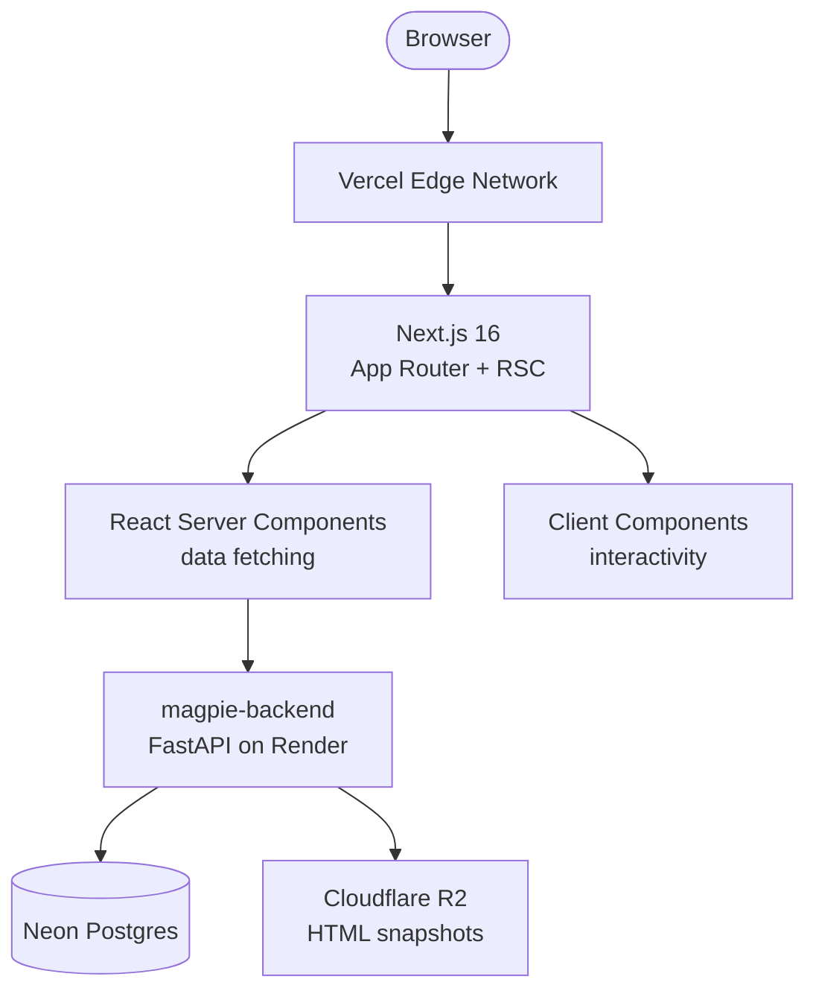

# 🐦‍⬛ `magpie-frontend`

> ✨ **Next.js 16 dashboard for YAML-defined scrapers that self-heal.**
> Terminal aesthetic. Emerald accent. Magpies collect shiny things.

🌐 [Live App](https://magpie-frontend-three.vercel.app) · 🔙 [Backend Repo](https://github.com/Abdul-Muizz1310/magpie-backend) · 🔗 [Backend API](https://magpie-backend-izzu.onrender.com/health) · 🚀 [Quickstart](#-run-locally)


---

```console
$ pnpm dev
  ▲ Next.js 16.0.0 (Turbopack)
  - Local:   http://localhost:3000
  - API:     https://magpie-backend-izzu.onrender.com

[sources]    6 configured scrapers · 4 healthy · 1 healing · 1 broken
[detail]     hackernews · 12 runs · 342 items · last: 2h ago
[heals]      3 self-heal PRs · 2 merged · 1 pending review
[demo]       interactive walkthrough loaded
```

---

## 🎯 Why this exists

**magpie-backend** runs YAML-defined scrapers that self-heal via LLM + PR. But a CLI and raw API aren't enough to monitor a fleet of scrapers. **magpie-frontend** gives you a dashboard to browse sources, inspect run history, track item diffs, and follow self-healing PRs -- all from a terminal-styled UI that feels like watching a pipeline run.

- 📊 **Sources at a glance** — health status, last run time, item counts
- 🔍 **Run drill-down** — per-source run history with item diffs
- 🧬 **Heal tracking** — every self-heal PR with GitHub links and status
- 🖥️ **Terminal aesthetic** — emerald accent, grid backgrounds, monospace, dark mode only

---

## ✨ Features

- 🖥️ Terminal-window UI chrome (grid backgrounds, status dots, monospace, emerald accent)
- 📊 Sources list with health status and latest run info
- 🔍 Source detail pages with full run history
- 🧬 Heal history page with GitHub PR links
- 🎬 Interactive demo walkthrough
- 🛡️ Zod v4 validation on all API responses
- ⚡ React Server Components for data fetching (fully dynamic per request via `connection()`)
- 🔐 Admin-gated mutations — create/edit/delete source and scrape triggers require a shared-secret session (fail-closed); read-only browsing is open
- 🧪 Vitest + Testing Library with MSW 2 API mocks
- 📱 Responsive terminal layout

---

## 🏗️ Architecture


```mermaid
flowchart TD
    Browser([Browser]) --> Vercel[Vercel Edge Network]
    Vercel --> Next["Next.js 16<br/>App Router + RSC"]
    Next --> RSC["React Server Components<br/>data fetching"]
    RSC --> API["magpie-backend<br/>FastAPI on Render"]
    API --> DB[("Neon Postgres")]
    API --> R2["Cloudflare R2<br/>HTML snapshots"]
    Next --> Client["Client Components<br/>interactivity"]
```

> **Rule:** `app/` routes are thin server components. Components handle presentation. `lib/` owns API calls and utilities.

---

## 📡 Page data flow

```mermaid
flowchart TD
    subgraph Sources Page [" / — Sources List"]
        SP_RSC["RSC page.tsx"] -->|fetch /sources| SP_API["magpie-backend"]
        SP_API -->|SourceSchema[].parse| SP_Render["SourceCard grid"]
    end

    subgraph Detail Page [" /sources/[name] — Source Detail"]
        DP_RSC["RSC page.tsx"] -->|fetch /sources/:name| DP_API["magpie-backend"]
        DP_API -->|SourceDetailSchema.parse| DP_Info["Source info header"]
        DP_RSC -->|fetch /runs?source=:name| DP_Runs["magpie-backend"]
        DP_Runs -->|RunSchema[].parse| DP_List["Run history list"]
    end

    subgraph Heals Page [" /heals — Heal History"]
        HP_RSC["RSC page.tsx"] -->|fetch /heals| HP_API["magpie-backend"]
        HP_API -->|HealSchema[].parse| HP_Render["Heal PR table"]
    end

    subgraph Demo Page [" /demo — Interactive Demo"]
        Demo_Client["Client component"] -->|mock data| Demo_Render["Demo walkthrough"]
    end
```

---

## 🗂️ Project structure

```
src/
├── app/                              # Next.js App Router (thin RSC pages)
│   ├── page.tsx                      # Home: sources list
│   ├── layout.tsx                    # Root layout + metadata
│   ├── loading.tsx                   # Route loading UI
│   ├── error.tsx                     # Route error boundary
│   ├── not-found.tsx                 # 404
│   ├── globals.css                   # Tailwind + terminal CSS
│   ├── sources/
│   │   ├── new/page.tsx              # Create a source
│   │   └── [name]/
│   │       ├── page.tsx              # Source detail + runs
│   │       ├── edit/page.tsx         # Edit source config
│   │       └── items/page.tsx        # Scraped items
│   ├── runs/[id]/page.tsx            # Live run view
│   ├── heals/page.tsx                # Self-heal PR history
│   └── demo/page.tsx                 # Interactive demo
├── components/
│   ├── terminal/                     # Chrome: AppNav, PageFrame, Prompt, StatusBar, TerminalWindow
│   ├── sources/                      # SourceCard, OriginBadge, DeleteSourceButton
│   ├── runs/                         # LiveRunView, RunRow, RunTriggerPanel, ScrapedItemsList
│   ├── heals/                        # HealDiff, HealEntry
│   ├── editor/                       # SourceEditor, FormBuilder, YamlTextarea
│   └── shared/                       # StatusBadge, Pagination, RelativeTime, ErrorAlert, BackendStatusDot
├── hooks/
│   └── useRunPoll.ts                 # Live run-status polling
└── lib/
    ├── api.ts                        # Fetch wrapper for the backend
    ├── data.ts                       # Server-side data fetching
    ├── actions.ts                    # Server actions (create / edit / delete / trigger)
    ├── schemas.ts                    # Zod schemas (API boundary validation)
    ├── yaml.ts                       # YAML <-> form-state conversion
    └── utils.ts                      # Utility helpers
```

Component and `lib` unit tests are co-located as `*.test.tsx` / `*.test.ts` next to the files they cover (omitted above for brevity).

> **Rule:** Server Components fetch data. Client Components handle interactivity. `lib/` owns all external I/O and validation.

---

## 🗺️ Routes

| Route | Purpose |
|---|---|
| `/` | 📊 Sources list — all configured scrapers with health status |
| `/sources/[name]` | 🔍 Source detail — run history, item counts, diffs |
| `/heals` | 🧬 Heal history — self-heal PRs with GitHub links |
| `/demo` | 🎬 Interactive demo walkthrough |

---

## 🛠️ Stack

| Concern | Choice |
|---|---|
| **Framework** | Next.js 16 (App Router, React Server Components) |
| **Language** | TypeScript 5.9 (strict) |
| **Styling** | Tailwind CSS v4 (terminal aesthetic, emerald accent) |
| **Validation** | Zod v4 (all API boundaries) |
| **Lint / Format** | Biome |
| **Testing** | Vitest + Testing Library |
| **API mocks** | MSW 2 |
| **Hosting** | Vercel |

---

## 🚀 Run locally

```bash
# 1. clone & install
git clone https://github.com/Abdul-Muizz1310/magpie-frontend.git
cd magpie-frontend
pnpm install

# 2. env
cp .env.example .env.local
# edit NEXT_PUBLIC_API_URL if backend runs elsewhere

# 3. dev
pnpm dev
# → http://localhost:3000
```

### 🌱 Environment

| Var | Purpose |
|---|---|
| `NEXT_PUBLIC_API_URL` | magpie-backend viewer API URL |
| `MAGPIE_ADMIN_SECRET` | Server-only admin secret gating all mutations + the `/login` password. Unset ⇒ mutations disabled (read-only). Never prefix with `NEXT_PUBLIC`. |

### 📜 Scripts

```bash
pnpm dev          # Next.js dev server (Turbopack)
pnpm build        # Production build
pnpm lint         # Biome check
pnpm typecheck    # TypeScript check
pnpm test         # Run Vitest tests
```

---

## 🧪 Testing

```bash
pnpm test                    # watch mode
pnpm test -- --run           # CI (single run)
pnpm test -- --coverage      # coverage report
```

| Metric | Value |
|---|---|
| **Tests** | 211 tests (unit + route-level) |
| **Line coverage** | **90%** |
| **Coverage scope** | Includes `app/**/page.tsx` composition logic and the error/not-found boundaries — route-level tests invoke each page against a mocked data layer (async RSCs can't be rendered in jsdom) and assert `notFound()`, `generateMetadata`, and pagination-offset behavior |
| **Framework** | Vitest + Testing Library + MSW 2 |
| **API mocking** | MSW 2 request handlers — no real backend in tests |
| **Validation** | Zod schemas validated in test assertions |
| **Methodology** | Spec-TDD — test cases enumerated before implementation |

---

## 📐 Engineering philosophy

| Principle | How it shows up |
|---|---|
| 🧪 **Spec-TDD** | Tests written before pages. MSW handlers define expected API shape. |
| 🛡️ **Negative-space programming** | Zod rejects malformed API responses at the boundary. TypeScript strict mode. No `any`. |
| 🧬 **Parse, don't validate** | Zod v4 on every API response. Invalid data fails loudly, never silently propagates. |
| 🏗️ **Separation of concerns** | `app/` thin RSC pages. `components/` presentation only. `lib/` owns I/O + validation. |
| 🔤 **Typed everything** | TypeScript 5.9 strict. Zod-inferred types flow from API to components. No untyped data crossing boundaries. |
| 🌊 **Pure core, imperative shell** | Utility functions pure. API calls + side effects isolated in `lib/`. |

---

## 🚀 Deploy

Hosted on **Vercel**. Push to `main` → Vercel build → preview URL → promote to prod.

Required env vars:

- `NEXT_PUBLIC_API_URL` (build time) — backend API URL.
- `MAGPIE_ADMIN_SECRET` (runtime, server-only) — set this in the Vercel project's
  Environment Variables (Production/Preview) to enable admin mutations. Leave it
  unset to ship a read-only dashboard.

---

## 📄 License

MIT. See [LICENSE](LICENSE).

---

> 🐦‍⬛ **`magpie-ui --help`** -- terminal dashboard for self-healing scrapers
