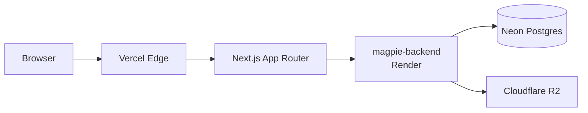

# Architecture

## System context



## App structure

```mermaid
graph TD
    Layout[RootLayout] --> Home[/ — Sources List]
    Layout --> Detail[/sources/name — Source Detail]
    Layout --> Heals[/heals — Heal History]
    Layout --> Demo[/demo — Demo Page]

    Home --> ApiClient[src/lib/api.ts]
    Detail --> ApiClient
    Heals --> ApiClient
    Demo --> ApiClient

    ApiClient --> Backend[GET /sources, /runs, /heals, /health]
```

## Key decisions

| Decision | Rationale |
|---|---|
| Server Components for data fetching | Pages fetch from the backend API at request time (or build time for static). No client-side loading spinners needed. |
| Zod validation at API boundary | Parse responses before they reach components. Fail fast on unexpected shapes. |
| No state management library | Server Components don't need client state. Each page is a fresh fetch. |
| Biome over ESLint+Prettier | Single tool, faster, fewer config files. |
| Vitest over Jest | Native ESM support, faster, better DX with Vite ecosystem. |
| `next/link` mock in tests | Next.js `Link` behaves differently in jsdom. Mocking to a plain `<a>` keeps tests deterministic. |

## Directory layout

```
src/
├── app/
│   ├── layout.tsx              # Root layout (fonts, metadata)
│   ├── page.tsx                # Sources list (/)
│   ├── sources/[name]/
│   │   └── page.tsx            # Source detail with run timeline
│   ├── heals/
│   │   └── page.tsx            # Heal history with config diffs
│   └── demo/
│       └── page.tsx            # Interactive demo walkthrough
├── lib/
│   ├── api.ts                  # Typed API client (Zod-validated)
│   └── test-utils.tsx          # Shared test helpers
└── test-setup.ts               # Vitest global setup (cleanup, jest-dom)
```

## Data flow

1. User hits a route (e.g., `/sources/hackernews`).
2. Next.js Server Component calls `fetchSource("hackernews")` + `fetchRuns({ source: "hackernews" })`.
3. `api.ts` makes GET requests to `NEXT_PUBLIC_API_URL` backend.
4. Response is validated with Zod. Invalid data throws at the boundary.
5. Component renders the validated data. Errors show an alert banner.
6. Static pages (`/`, `/demo`, `/heals`) are pre-rendered at build time with ISR fallback.
