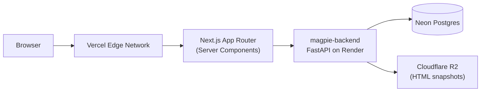
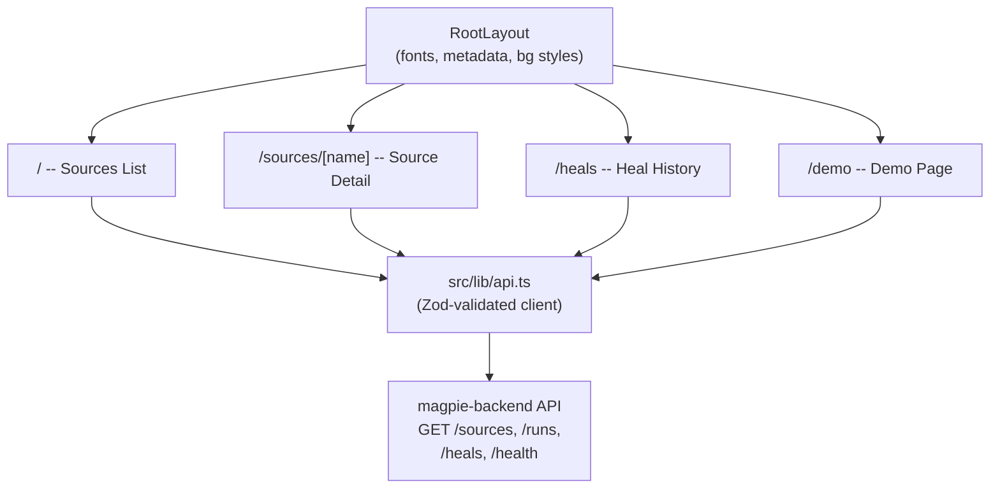
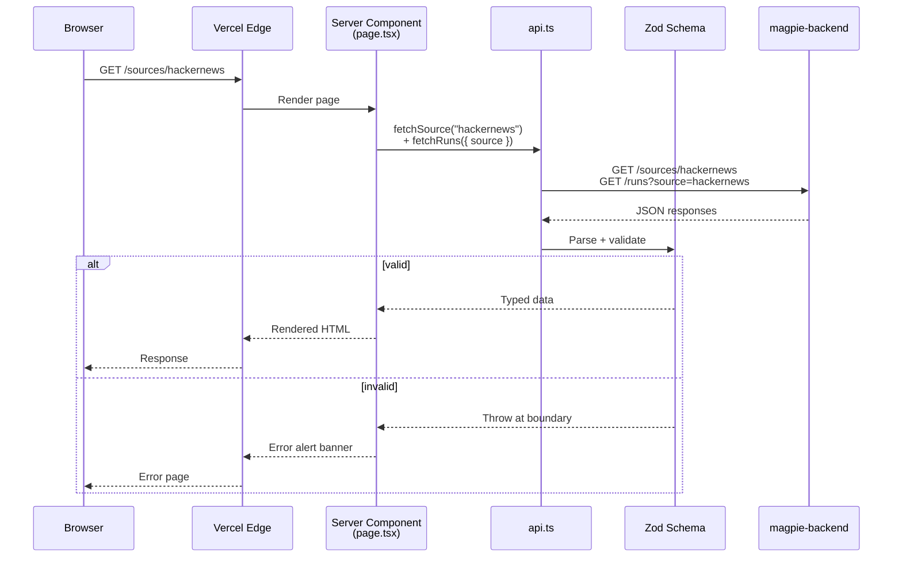
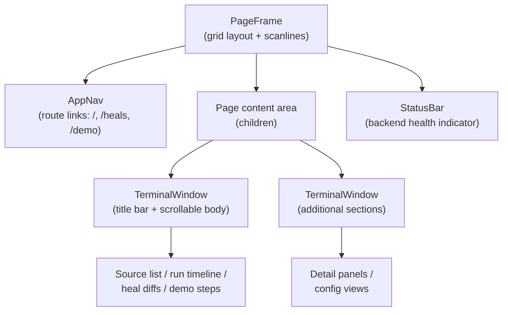

# Architecture

## System context



## App structure



## Page lifecycle

Each route is a Server Component that fetches data at request time (or build time for static/ISR pages), validates with Zod, and renders. No client-side loading spinners needed.



## Terminal component hierarchy

The UI uses a retro terminal aesthetic. `PageFrame` provides the outer chrome, `TerminalWindow` wraps each content section, and `AppNav` + `StatusBar` provide navigation and status.



## Key decisions

| Decision | Rationale |
|---|---|
| Server Components for data fetching | Pages fetch from the backend API at request time (or build time for static). No client-side loading spinners needed. |
| Zod validation at API boundary | Parse responses before they reach components. Fail fast on unexpected shapes. |
| No state management library | Server Components don't need client state. Each page is a fresh fetch. |
| Biome over ESLint+Prettier | Single tool, faster, fewer config files. |
| Vitest over Jest | Native ESM support, faster, better DX with Vite ecosystem. |
| `next/link` mock in tests | Next.js `Link` behaves differently in jsdom. Mocking to a plain `<a>` keeps tests deterministic. |
| Terminal aesthetic (PageFrame + TerminalWindow) | Distinctive visual identity; avoids generic dashboard look. Consistent chrome across all routes. |
| ISR for static pages | `/`, `/demo`, `/heals` are pre-rendered at build time with ISR fallback for freshness without SSR cost. |

## Directory layout

```
src/
├── app/                        # App Router (thin RSC pages)
│   ├── layout.tsx              # Root layout (fonts, metadata, bg styles)
│   ├── page.tsx                # Sources list (/)
│   ├── loading.tsx / error.tsx / not-found.tsx
│   ├── sources/
│   │   ├── new/page.tsx        # Create a source
│   │   └── [name]/page.tsx     # Source detail + run timeline
│   │       (+ edit/, items/ subroutes)
│   ├── runs/[id]/page.tsx      # Live run view
│   ├── heals/page.tsx          # Heal history with config diffs
│   └── demo/page.tsx           # Interactive demo walkthrough
├── components/
│   ├── terminal/               # Chrome: PageFrame, TerminalWindow, AppNav, StatusBar, Prompt
│   ├── sources/                # SourceCard, OriginBadge, DeleteSourceButton
│   ├── runs/                   # LiveRunView, RunRow, RunTriggerPanel, ScrapedItemsList
│   ├── heals/                  # HealDiff, HealEntry
│   ├── editor/                 # SourceEditor, FormBuilder, YamlTextarea
│   └── shared/                 # StatusBadge, Pagination, RelativeTime, ErrorAlert, BackendStatusDot
├── hooks/
│   └── useRunPoll.ts           # Live run-status polling
└── lib/
    ├── api.ts                  # Backend fetch wrapper
    ├── data.ts                 # Server-side data fetching
    ├── actions.ts              # Server actions (create / edit / delete / trigger)
    ├── schemas.ts              # Zod schemas (API boundary validation)
    ├── yaml.ts                 # YAML <-> form-state conversion
    └── utils.ts                # Utility helpers
```

Component and `lib` tests are co-located as `*.test.tsx` / `*.test.ts`.

## Data flow

1. User hits a route (e.g., `/sources/hackernews`).
2. Next.js Server Component calls `fetchSource("hackernews")` + `fetchRuns({ source: "hackernews" })`.
3. `api.ts` makes GET requests to `NEXT_PUBLIC_API_URL` backend.
4. Response is validated with Zod. Invalid data throws at the boundary.
5. Component renders the validated data. Errors show an alert banner.
6. Static pages (`/`, `/demo`, `/heals`) are pre-rendered at build time with ISR fallback.
